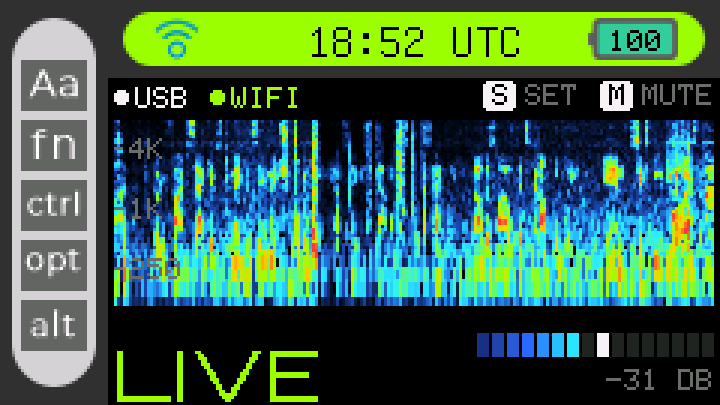
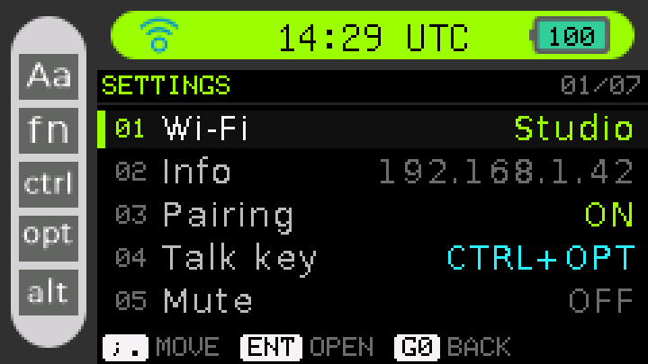
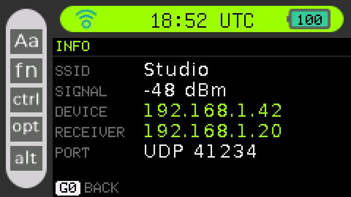
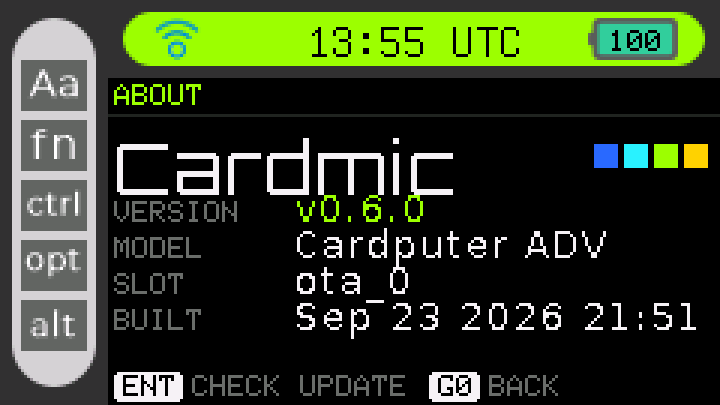

<p align="center">
  
</p>

<h1 align="center">Cardmic</h1>

<p align="center">
  <b>Turn an M5Stack Cardputer ADV into a microphone.</b><br>
  Plug it in over USB and it just works. Unplug it and keep talking over Wi-Fi.
</p>

<p align="center">
  <a href="https://github.com/Yueze/Cardmic/releases/latest"></a>
  <a href="https://github.com/Yueze/Cardmic/actions/workflows/firmware.yml"></a>
  <a href="https://github.com/Yueze/Cardmic/actions/workflows/client.yml"></a>
  <a href="LICENSE"></a>
</p>

<p align="center">
  
</p>

---

Cardmic is an app for the Cardputer ADV's factory firmware. It keeps the stock
boot screen, launcher and apps, and adds a microphone that your computer can
use two ways:

- **USB.** A standard USB Audio Class microphone. No driver, no client, no
  setup. It shows up as **Cardmic Microphone**.
- **Wi-Fi.** A 16 kHz stream to the Cardmic app on your computer (Dock and menu
  bar on macOS, notification area on Windows), which turns the stream into a
  microphone every app can pick.

## Features

|  |  |
|---|---|
| **Driverless USB mic** | USB Audio Class 2.0, 16 kHz mono. Tested with macOS; Windows 10+ and Linux ship the same class driver. |
| **Wireless mode** | UDP streaming on the local network, 20 ms packets, loss concealment, automatic discovery. |
| **Lives in the stock firmware** | Installed as one more app in M5Stack's launcher. Nothing else on the device changes. |
| **On-device setup** | Scan and join Wi-Fi with the built-in keyboard. No phone app, no config files. |
| **Hold to talk** | Over USB the Cardputer is also a one-key keyboard: hold Space to hold your dictation app's shortcut. [More](docs/talk-key.md) |
| **Private by pairing** | Turn on pairing, type the code shown on screen into the client once, and wireless audio is encrypted (AES-128-GCM) for that computer only. |
| **Live spectrogram** | 100 Hz – 8 kHz heat map, one column per 10 ms, the last 2 seconds on screen, plus a segmented level meter with peak hold. |
| **Clean signal path** | ES8311 codec at +30 dB PGA, DC removal, 100 Hz high-pass (4th order), three gain steps. |
| **Updates over Wi-Fi** | Checks GitHub Releases from the device and installs new versions, with automatic rollback. |
| **Open protocol** | A few pages of [spec](protocol/PROTOCOL.md) and reference code on both ends. |

## Screens

<table>
  <tr>
    <td></td>
    <td></td>
    <td></td>
  </tr>
  <tr>
    <td align="center"><sub>Settings: Wi-Fi, info, mute, gain, about</sub></td>
    <td align="center"><sub>Info: signal, addresses, receiver</sub></td>
    <td align="center"><sub>About: version and over-the-air update</sub></td>
  </tr>
</table>

<sub>Pixel-exact captures from the device (`cardmic screenshot`), shown at 3x.
Network details in the captures are placeholders.</sub>

## Quick start

> **Which Cardputer?** Made for the **Cardputer ADV**. The **original
> Cardputer** is supported from 0.6.0 as *experimental*: it has a different
> keyboard (a GPIO matrix instead of the ADV's TCA8418 chip) and a PDM
> microphone instead of the ES8311 codec, and those two paths are ported from
> M5Stack's own firmware but not yet tested on the hardware. The firmware
> detects the model at boot; on the original, the IMU, LoRa and GPS apps are
> hidden because that hardware is missing. Reports welcome.

**1. Install the firmware (once).** Open the
**[browser installer](https://yueze.github.io/Cardmic/)** in Chrome or Edge,
plug in the Cardputer and click Install. Or flash the `-full.bin` from the
[latest release](https://github.com/Yueze/Cardmic/releases/latest) with
esptool: [docs/flashing.md](docs/flashing.md).

**2. Use it over USB.** Open **Cardmic** in the launcher, plug the Cardputer
into your computer, and choose **Cardmic Microphone** as the input.

**3. Use it over Wi-Fi.** In Cardmic, press `S` > **Wi-Fi** and join your
network. On the computer, install the Cardmic app from the
[latest release](https://github.com/Yueze/Cardmic/releases/latest)
(`Cardmic-macOS.dmg` or `Cardmic-Windows-Setup.exe`) and open it. It finds
the Cardputer by itself. Click its icon, three dots, for a menu that tells
you which microphone to choose in your app and pairs the two for privacy. Details:
[macOS](docs/macos.md) · [Windows](docs/windows.md).

Prefer a terminal? The same engine ships as the `cardmic` command
(`cardmic run`, `cardmic pair CODE`, `cardmic doctor`).

## What your computer needs

| | macOS | Windows |
|---|---|---|
| **USB mode** | Nothing | Nothing |
| **Wi-Fi mode** | Cardmic app + [BlackHole 2ch](https://existential.audio/blackhole/) | Cardmic app + [VB-CABLE](https://vb-audio.com/Cable/) |

A virtual device you already have (from Zoom, Teams, Loopback and similar) may
work instead of BlackHole or VB-CABLE; the app tests them and picks one that
works.

## Controls

| Key | Where | Action |
|---|---|---|
| `S` or `Enter` | Main | Open settings |
| `M` | Main | Mute / unmute (the stream keeps running, silent) |
| `Space` (hold) | Main | Hold to talk, when a talk key is set |
| `N` | Pairing | New pairing code (unpairs every computer) |
| `;` `.` | Lists | Move up / down |
| `Enter` | Lists | Select |
| `Tab` | Password | Show / hide |
| `Esc` | Settings pages | Back |
| `G0` | Anywhere | Back; on the main screen, exit to the launcher |

## How it works

```
 Cardputer ADV (ESP32-S3)                              Computer
 ┌──────────────────────────────────┐
 │ ES8311 codec ─ I2S 16 kHz        │    USB Audio Class
 │   └─ DC block ─ 100 Hz HPF ─ gain├───────────────────────► any app
 │        │                         │
 │        └─ UDP packets (20 ms) ───┼───── Wi-Fi ─────► cardmic run
 │                                  │                     │ reorder, conceal,
 │ Stock launcher + apps (M5Stack)  │                     │ resample
 └──────────────────────────────────┘                     ▼
                                               loopback device ─► any app
```

The firmware is M5Stack's factory firmware
([M5Cardputer-UserDemo](https://github.com/m5stack/M5Cardputer-UserDemo), ESP-IDF
5.4) with Cardmic added as an app in
[`firmware/main/apps/app_cardmic`](firmware/main/apps/app_cardmic). The desktop
client, in [`client/`](client), is Rust on [cpal](https://github.com/RustAudio/cpal):
one receiving engine behind both the menu bar app
([tray-icon](https://github.com/tauri-apps/tray-icon)) and the `cardmic`
command.

## Build from source

**Firmware** (ESP-IDF v5.4.2):

```bash
cd firmware
python3 fetch_repos.py        # stock dependencies: M5GFX, M5Unified, mooncake...
idf.py build
./tools/package.sh            # dist/cardmic-ota.bin and dist/cardmic-<ver>-full.bin
```

**Client** (Rust 1.90+):

```bash
cd client
cargo test --workspace
cargo build --release         # target/release/cardmic and cardmic-app
tray/macos/bundle.sh          # macOS: target/macos/Cardmic.app and Cardmic.dmg
```

On Windows, `tray/windows/cardmic.iss` builds the installer with
[Inno Setup](https://jrsoftware.org/isinfo.php).

No hardware? `cardmic-synth` stands in for a device and streams a test tone,
so the client can be developed end to end:

```bash
cargo run -p cardmic-synth &                         # listens on UDP 41235
cargo run -p cardmic -- run --device 127.0.0.1:41235
```

## Status and roadmap

Cardmic is young. What works today, and what is next:

- [x] USB microphone, verified on macOS
- [x] Wireless streaming with the desktop client, verified on macOS and Windows
- [x] Menu bar app (macOS) and tray app (Windows); verified on macOS
- [x] On-device Wi-Fi setup, settings, over-the-air updates
- [x] Pairing and encryption for wireless mode (off by default; turn it on in Settings > Pairing)
- [x] Hold-to-talk key for dictation apps (USB keyboard + microphone)
- [x] Browser installer
- [ ] A registered USB vendor/product ID (the firmware uses a development ID for now)
- [ ] An M5Burner listing
- [ ] Signed and notarized desktop builds (until then, macOS asks you to confirm the first launch)
- [ ] Cardmic's own virtual microphone, so no BlackHole or VB-CABLE is needed

Issues and pull requests are welcome.

## License

[MIT](LICENSE). The firmware is a fork of M5Stack's MIT-licensed factory
firmware; see [NOTICE.md](NOTICE.md) for third-party credits. Cardmic is an
independent project, not affiliated with M5Stack.
