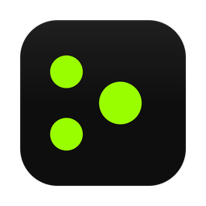
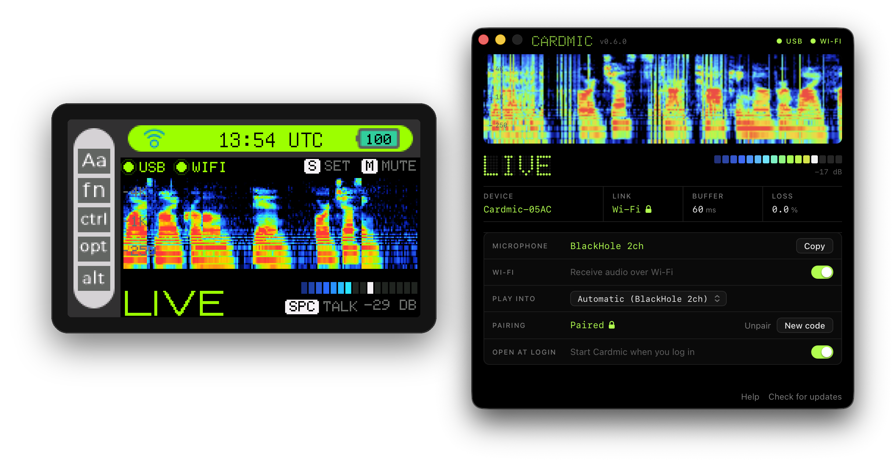
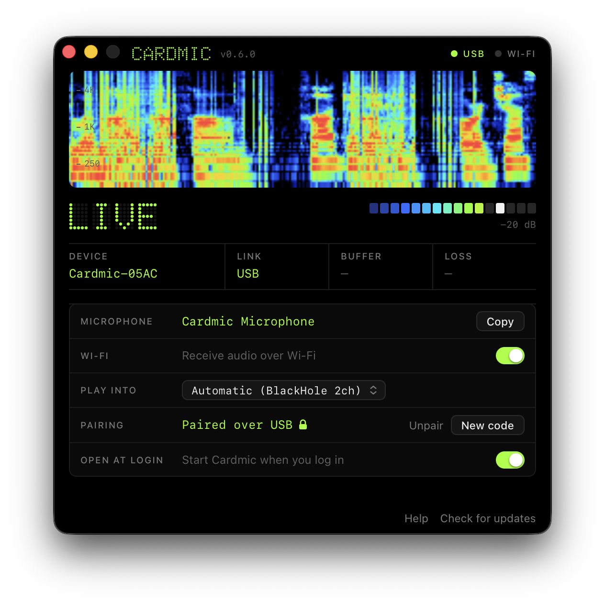
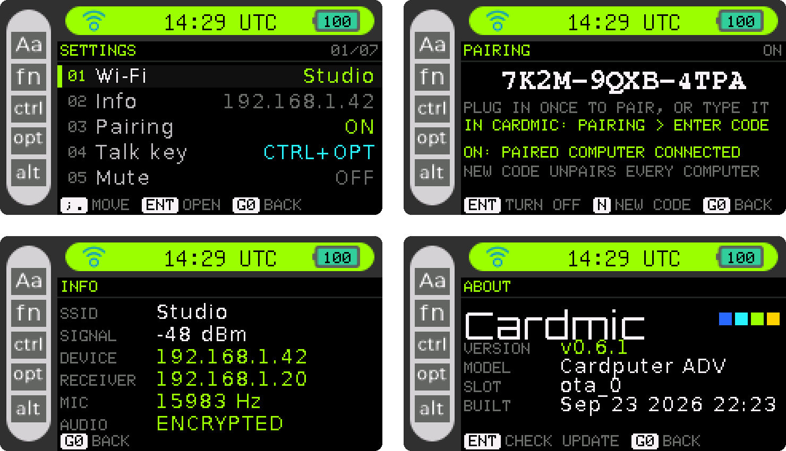

<p align="center">
  
</p>

<h1 align="center">Cardmic</h1>

<p align="center">
  <b>A USB and Wi-Fi microphone for the M5Stack Cardputer.</b><br>
  Talk to Wispr Flow, Typeless, Superwhisper or any dictation app, over USB or Wi-Fi.<br>
  No driver, a push-to-talk key over USB, and it runs inside the stock firmware.
</p>

<p align="center">
  <a href="https://github.com/Yueze/Cardmic/releases/latest"></a>
  <a href="https://github.com/Yueze/Cardmic/actions/workflows/firmware.yml"></a>
  <a href="https://github.com/Yueze/Cardmic/actions/workflows/client.yml"></a>
  <a href="LICENSE"></a>
</p>

<p align="center">
  
</p>

<p align="center">
  <a href="https://yueze.github.io/Cardmic/"><b>Install the firmware</b></a> &nbsp;·&nbsp;
  <a href="https://github.com/Yueze/Cardmic/releases/latest"><b>Download the app</b></a> &nbsp;·&nbsp;
  <a href="docs/macos.md">macOS</a> &nbsp;·&nbsp;
  <a href="docs/windows.md">Windows</a> &nbsp;·&nbsp;
  <a href="protocol/PROTOCOL.md">Protocol</a>
</p>

---

Cardmic is an app for the Cardputer's factory firmware. M5Stack's launcher and
apps stay as they are; Cardmic adds one more, and the Cardputer becomes a
microphone your computer can use in two ways.

<table>
  <tr>
    <td width="33%" valign="top">
      <b>USB, no setup</b><br><br>
      A standard USB Audio Class microphone. No driver and no app: it shows up
      as <b>Cardmic Microphone</b>.
    </td>
    <td width="33%" valign="top">
      <b>Wi-Fi, no cable</b><br><br>
      The Cardmic app on your Mac or PC receives the stream and turns it into
      a microphone every app can choose. It finds the Cardputer by itself.
    </td>
    <td width="33%" valign="top">
      <b>Private by default</b><br><br>
      Plug in once and the two pair themselves. From then on the wireless
      audio is encrypted, and only your paired computers receive it.
    </td>
  </tr>
</table>

## Works with your dictation app

Cardmic is a standard microphone, so every voice-typing app can listen to
it. Over USB the Cardputer is also a push-to-talk key: hold `Space` and it
holds your app's dictation shortcut; let go and it lets go.

| App | Platforms | Choose Cardmic in | Push-to-talk from the Cardputer |
|---|---|---|---|
| [Wispr Flow](https://wisprflow.ai) | macOS, Windows | Settings > General > Microphone > Change. Over Wi-Fi, the virtual device is under *Show other devices*. | Matches its defaults: talk key `CTRL+WIN` on Windows, `CTRL+OPT` on Macs without a Fn key (with one, pick Control + Option as the shortcut in Wispr Flow). |
| [Typeless](https://www.typeless.com) | macOS, Windows | The system's input device | Shortcut customizable in Settings > Shortcuts |
| [Superwhisper](https://superwhisper.com) | macOS | Settings > Sound > Input Device | Push-to-talk shortcut customizable in its settings |
| [Handy](https://github.com/cjpais/Handy) (open source) | macOS, Windows, Linux | Its microphone setting | Shortcut customizable; push-to-talk on by default |
| macOS Dictation | macOS | System Settings > Keyboard > Dictation > Microphone source | — |
| Windows voice typing (`Win`+`H`) | Windows | Settings > System > Sound > Input | — |

Any other app that takes a microphone works the same way: VoiceInk, Doubao
Input (豆包输入法), and calls, recording or streaming apps. Pick
**Cardmic Microphone** over USB; over Wi-Fi, pick the virtual device the
Cardmic app names.

The talk key sends `Ctrl`+`Option`, `Ctrl`+`Win` or `F13`: any app whose
shortcut setting accepts one of those can use the Cardputer's `Space` as its
push-to-talk key. Set-up: [Hold to talk](docs/talk-key.md).

## The app



A small window in the language of the device: the same spectrogram and
segmented meter, and a few readouts that say at a glance what is connected
and how well.

- **Live view.** Spectrogram, level and peak, on the same scale and in the
  same colours as the Cardputer's screen.
- **The link at a glance.** Device, link, buffer and loss, with a lock when
  the audio is encrypted.
- **The microphone to choose.** The name to pick in your app, with a Copy
  button.
- **Pairing without typing.** Plugged in over USB, the Cardputer hands its
  pairing code to the app. Unplug it and Wi-Fi keeps working, encrypted.
- **Stays out of the way.** Opens at login, lives in the Dock and the menu
  bar (the notification area on Windows), and updates itself.

<br clear="right">

## On the Cardputer

<p align="center">
  
</p>

<p align="center"><sub>
  Settings · Pairing · Info · About. Pixel-exact captures from the device at
  3x; network details are placeholders.
</sub></p>

Everything is set up on the device, with its own keyboard: join Wi-Fi, give
it a name, choose a gain step or a talk key, install updates. No phone app,
no config files. A name set in Settings > Name is what your computer lists
the microphone as, so two Cardputers are easy to tell apart.

## Get started

**1. Install the firmware, once.** Open the
**[browser installer](https://yueze.github.io/Cardmic/)** in Chrome or Edge,
plug in the Cardputer and click Install. Or flash the `-full.bin` from the
[latest release](https://github.com/Yueze/Cardmic/releases/latest) with
esptool: [docs/flashing.md](docs/flashing.md). Later versions install over
Wi-Fi from Settings > About.

**2. Use it over USB.** Open **Cardmic** in the launcher, plug the Cardputer
into your computer, and choose **Cardmic Microphone** in your app.

**3. Use it over Wi-Fi.** On the Cardputer, Settings > **Wi-Fi** joins your
network. On the computer, install the Cardmic app from the
[latest release](https://github.com/Yueze/Cardmic/releases/latest)
(`Cardmic-macOS.dmg` or `Cardmic-Windows-Setup.exe`) and a virtual audio
device (below). Plug the Cardputer in once so the two pair (pairing is on by
default), then choose the microphone the app names, such as
**BlackHole 2ch**, in your app. No cable at hand? Type the code from the
Cardputer's Settings > Pairing into the app instead.

Step by step: [macOS](docs/macos.md) · [Windows](docs/windows.md).

| | macOS 13 or later | Windows 10 or 11 |
|---|---|---|
| **USB** | Nothing to install | Nothing to install |
| **Wi-Fi** | Cardmic app + [BlackHole 2ch](https://existential.audio/blackhole/) | Cardmic app + [VB-CABLE](https://vb-audio.com/Cable/) |

A virtual device you already have (from Zoom, Teams, Loopback and similar) may
do instead: the app tests them and picks one that works.

## Specifications

<table>
  <tr><td><b>Audio</b></td><td>16 kHz, mono, 16-bit PCM</td></tr>
  <tr><td><b>Signal&nbsp;path</b></td><td>Cardputer ADV: ES8311 codec at +30 dB PGA. Original Cardputer: PDM microphone. Then DC removal, 100 Hz high-pass (4th order), three gain steps.</td></tr>
  <tr><td><b>USB</b></td><td>USB Audio Class 2.0, plus a HID keyboard when a talk key is set. Verified on macOS; Windows 10+ and Linux include the class driver.</td></tr>
  <tr><td><b>Wi-Fi</b></td><td>2.4 GHz, UDP on the local network, 20 ms packets, automatic discovery</td></tr>
  <tr><td><b>Buffering</b></td><td>60 ms on a clean network. Grows when Wi-Fi stalls (up to 400 ms), shrinks back once it is calm.</td></tr>
  <tr><td><b>Loss&nbsp;handling</b></td><td>Packets reordered; gaps of up to 100 ms concealed</td></tr>
  <tr><td><b>Security</b></td><td>Pairing, on by default: a code shown on the device, handed over USB or typed once. Paired audio is encrypted with AES-128-GCM; other computers are refused.</td></tr>
  <tr><td><b>Display</b></td><td>100 Hz to 8 kHz spectrogram, a column every 10 ms; 16-segment meter with peak hold</td></tr>
  <tr><td><b>Updates</b></td><td>Device: over Wi-Fi from GitHub Releases, with automatic rollback. App: downloads in the background, installs when idle.</td></tr>
  <tr><td><b>Devices</b></td><td>Cardputer ADV; original Cardputer (v1.1) from 0.6.0</td></tr>
  <tr><td><b>Computers</b></td><td>macOS 13 or later, Apple silicon and Intel; Windows 10 or 11, x64</td></tr>
</table>

<details>
<summary><b>Which Cardputer?</b></summary>
<br>

Cardmic is made for the **Cardputer ADV**. The **original Cardputer** is
supported from 0.6.0. It has a different keyboard (a GPIO matrix instead of
the ADV's TCA8418) and a PDM microphone instead of the ES8311 codec; both are
ported from M5Stack's own firmware and have been tested by users on a
Cardputer v1.1. The firmware detects the model at boot. On the original, the
IMU, LoRa and GPS apps are hidden, since that hardware is not there.
</details>

## Controls

| Key | Where | Action |
|---|---|---|
| `S` or `Enter` | Main | Open Settings |
| `M` | Main | Mute or unmute (the stream keeps running, silent) |
| `Space` (hold) | Main | Hold to talk, when a talk key is set |
| `;` `.` | Lists | Move up and down |
| `Enter` | Lists | Select |
| `Enter` | Pairing | Turn pairing on or off |
| `N` | Pairing | New code (unpairs every computer) |
| `Enter` | About | Check for an update, then install it |
| `Enter` | Name | Save the name (empty: back to Cardmic-XXXX) |
| `Tab` | Password | Show or hide |
| `Esc` | Settings pages | Back |
| `G0` | Anywhere | Back; on the main screen, exit to the launcher |

## How it works

```
 Cardputer (ESP32-S3)                                          Computer
┌──────────────────────────────────────┐
│ mic ─ DC block ─ 100 Hz HPF ─ gain ──┼─ USB Audio Class ───────────► any app
│                             │        │
│                             └────────┼─ Wi-Fi: UDP, 20 ms ──► Cardmic app
│                                      │   (AES-GCM if paired)    │ reorder, conceal,
│ M5Stack launcher and apps, unchanged │                          │ resample
└──────────────────────────────────────┘                          ▼
                                                     virtual audio device ─► any app
```

The firmware is M5Stack's factory firmware
([M5Cardputer-UserDemo](https://github.com/m5stack/M5Cardputer-UserDemo),
ESP-IDF 5.4) with Cardmic added as an app, in
[`firmware/main/apps/app_cardmic`](firmware/main/apps/app_cardmic). The
desktop client in [`client/`](client) is Rust: one receiving engine on
[cpal](https://github.com/RustAudio/cpal) behind both the app (a native
window around a web view, with [tao](https://github.com/tauri-apps/tao) and
[wry](https://github.com/tauri-apps/wry)) and the `cardmic` command-line
tool. The wire format is short and open:
[protocol/PROTOCOL.md](protocol/PROTOCOL.md).

## Build from source

**Firmware** (ESP-IDF v5.4.2):

```bash
cd firmware
python3 fetch_repos.py        # stock dependencies: M5GFX, M5Unified, mooncake...
idf.py build
./tools/package.sh            # dist/cardmic-ota.bin and dist/cardmic-<ver>-full.bin
```

**Client** (Rust 1.90 or later):

```bash
cd client
cargo test --workspace
cargo build --release         # target/release/cardmic and cardmic-app
tray/macos/bundle.sh          # macOS: target/macos/Cardmic.app and Cardmic.dmg
```

On Windows, `tray/windows/cardmic.iss` builds the installer with
[Inno Setup](https://jrsoftware.org/isinfo.php).

No hardware? `cardmic-synth` stands in for a Cardputer and streams a test
tone, so the client can be developed end to end:

```bash
cargo run -p cardmic-synth &                         # listens on UDP 41235
cargo run -p cardmic -- run --device 127.0.0.1:41235
```

## Status

- [x] USB microphone, verified on macOS
- [x] Wireless streaming, verified on macOS and Windows
- [x] Desktop app with pairing over USB and self-updates: verified on macOS; on Windows, built and unit-tested in CI
- [x] On-device Wi-Fi setup, settings and over-the-air updates
- [x] Encrypted wireless audio for paired computers
- [x] Hold-to-talk key for dictation apps
- [x] Original Cardputer support
- [x] Browser installer
- [ ] A registered USB vendor and product ID (a development ID for now)
- [ ] Signed and notarized desktop builds (until then, macOS asks you to confirm the first launch)
- [ ] Cardmic's own virtual microphone, so that no BlackHole or VB-CABLE is needed
- [ ] An M5Burner listing

Issues and pull requests are welcome.

## License

[Apache License 2.0](LICENSE).

The firmware is a fork of M5Stack's MIT-licensed factory firmware: the files
that come from it keep their MIT license (see their headers), and Cardmic's
own code is under Apache 2.0. See [NOTICE.md](NOTICE.md) for third-party
credits. Cardmic is an independent project, not affiliated with M5Stack.

Wispr Flow, Typeless, Superwhisper, Handy, VoiceInk, Doubao and the other
product names above are trademarks of their respective owners, used here
only to say what Cardmic works with. Cardmic is not affiliated with or
endorsed by any of them.
